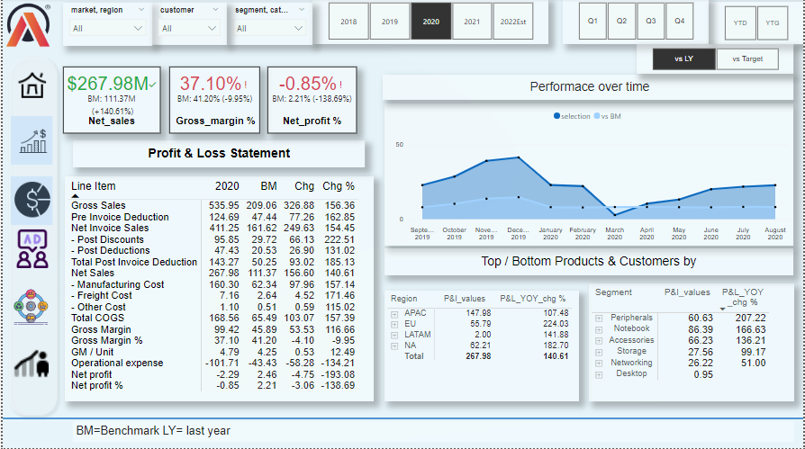
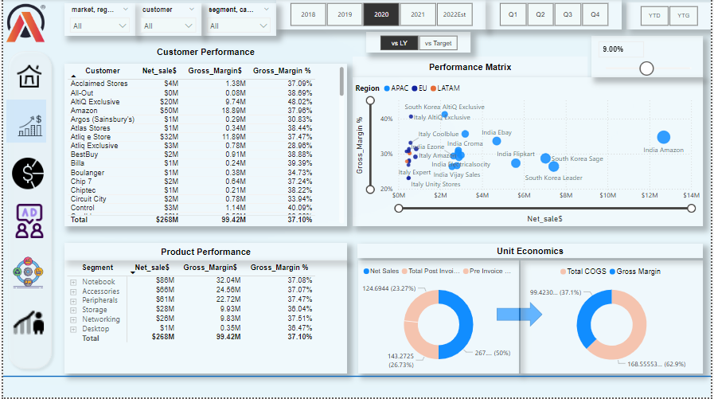
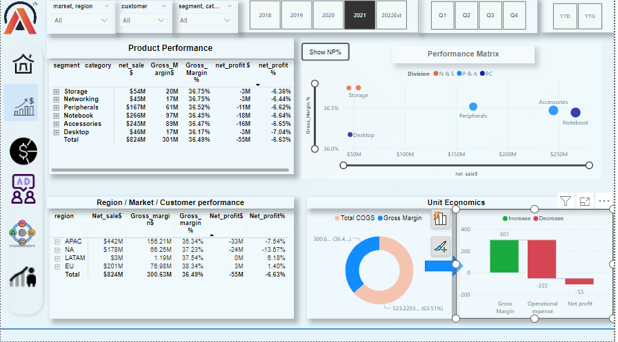

# Atliq IT Hardware Company Analysis Dashboard

**Date**: October 26, 2024  
**Role**: Data Analyst, Atliq IT Hardware  
**Technologies**: Power BI, Power Query, DAX, Data Cleaning, Data Visualization  
**Data Source**: Atliq IT Hardware Historical Data  

---

## Project Overview  

### Background  

Atliq, a leading IT hardware provider, faced challenges in efficiently managing and analyzing performance across finance, sales, marketing, supply chain, and executive decision-making. I created a series of interactive dashboards to give Atliq’s leadership a holistic view of these functions, enabling them to make data-driven decisions for strategic growth. Each dashboard targets a specific department, delivering actionable insights to support Atliq’s market objectives.

---

## Objective

The objective was to process and structure Atliq’s historical data to develop key business insights, using **Power Query** for data cleaning and **DAX** for custom calculations. The result is a suite of interactive dashboards, providing department-specific intelligence.

---

## Dashboard Suite Overview

This project includes five dashboards, each tailored to Atliq’s major operational areas: **Finance**, **Sales**, **Marketing**, **Supply Chain**, and **Executive View**.

---

### 1. Finance View  

This Finance View dashboard in the Business 360 project provides a comprehensive snapshot of Atliq’s financial trends. It highlights revenue, profit margins, and cost breakdowns over time, enabling the finance team to identify profitable regions, manage cost centers, and uncover growth opportunities effectively. Key performance indicators like Net Sales, Gross Margin, and Net Profit percentage provide a quick overview of financial health compared to the previous year. The Profit & Loss statement further breaks down revenue and expenses, helping to pinpoint areas of improvement.

Regional and segment analysis offers deeper insights, showcasing the highest and lowest-performing markets and product lines. Monthly trend analysis adds context, allowing the team to spot seasonal patterns or external impacts on performance. This finance view empowers Atliq’s financial team to make data-driven decisions, optimize costs, and prioritize high-growth areas for strategic planning.

---

### 2. Sales View  

This Sales View dashboard in the Business 360 project offers a strategic overview of Atliq’s sales performance by product, region, and sales channel. It highlights key metrics like Net Sales and Gross Margin, helping the sales team quickly identify top-performing products and regions. The Customer Performance and Product Performance sections reveal high-revenue segments and profitable customer relationships, while the Performance Matrix shows regional trends, allowing for better territory management. Seasonal patterns in sales data further aid in forecasting and inventory planning, empowering Atliq's sales team to optimize product focus, improve customer targeting, and maximize regional sales growth.

---

### 3. Marketing View  

This Marketing View dashboard in the Business 360 project provides insights into campaign effectiveness by tracking key metrics like ROI, customer acquisition, and engagement rates. It enables Atliq’s marketing team to evaluate each campaign’s impact and identify high-performing initiatives. By comparing these metrics across campaigns, the team can strategically allocate resources toward campaigns that drive the most customer engagement and deliver the best return on investment. This data-driven approach helps optimize marketing spend, increase customer acquisition efficiency, and ultimately improve the overall impact of Atliq's marketing strategy.

---

### 4. Supply Chain View  

The supply chain view tracks **inventory levels, order fulfillment rates, and lead times** to optimize Atliq’s inventory management and reduce stock shortages, directly supporting smoother operations and customer satisfaction.

---

### 5. Executive View  

At the highest level, the Executive View presents a consolidated summary of Atliq’s overall performance, highlighting KPIs such as **revenue growth, market share, and customer satisfaction**. This dashboard is designed to give top-level managers a quick yet thorough view of the company’s health.

---

## Key Insights

From these dashboards, Atliq can gain insights into:
- **High-profit regions and products** (Finance View)
- **Seasonal sales trends and top-performing segments** (Sales View)
- **Top-performing marketing campaigns with optimal ROI** (Marketing View)
- **Supply chain efficiencies and areas for improvement** (Supply Chain View)
- **Overall business performance metrics for executive planning** (Executive View)

---

## Recommendations

To capitalize on these insights, the following actions are recommended:

1. **Inventory Optimization**: Adjust stock levels to better meet demand in high-growth regions.
2. **Sales Strategy Refinement**: Focus sales efforts on top-performing products and channels.
3. **Targeted Marketing Investment**: Allocate budget to campaigns demonstrating the highest engagement and ROI.
4. **Cost Management**: Address cost inefficiencies in regions with lower profitability.
5. **Strategic Executive Planning**: Use KPI trends to guide long-term business strategy and resource allocation.

---

## Technologies Used  

- **Power BI**: For creating a suite of interactive, visually appealing dashboards.
- **Power Query**: To process and clean data for a smooth analytical experience.
- **DAX**: For custom calculations, such as financial ratios, ROI, and growth metrics, supporting in-depth analysis.

---

## [Download Power BI Dashboards](https://app.powerbi.com/view?r=eyJrIjoiMWE0MmRhOGEtYmFmYS00NTc3LTkzZjgtNzVhMDkwMmMwZGUxIiwidCI6ImM2ZTU0OWIzLTVmNDUtNDAzMi1hYWU5LWQ0MjQ0ZGM1YjJjNCJ9)

---

**Presented by Vidyalaxmi Mallya, Data Analyst** 

